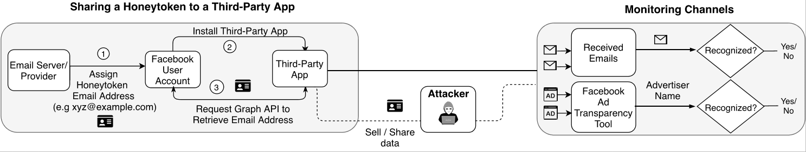

# CanaryTrap: Detecting Data Misuse by Third-Party Apps on Online Social Networks

Third-party apps on Facebook get access to personal information of users. The [Cambridge Analytica](https://www.theguardian.com/news/series/cambridge-analytica-files) incident showed that third-party apps on Facebook can seriously misuse user data.  

We design and implement CanaryTrap to independently detect misuse of data shared with third-party apps on Facebook. At a high-level, CanaryTrap shares a *honeytoken* (e.g., email address) with a third-party app and monitors its *unrecognized* use via different channels (e.g., received emails).   

We deployed CanaryTrap to monitor 1,024 Facebook apps for more than a year. Our main results are:
- We found that data shared with 1.2% third-party apps on Facebook has been potentially misused.

- We found that many third-party apps on Facebook apps do not fully comply with Facebook's [TOS](https://developers.facebook.com/policy/) that require app developers to respond to data deletion requests by users. 

Read our peer-reviewed [manuscript](https://homepage.divms.uiowa.edu/~sfarooqi/Files/farooqiCanaryTrap-pets20.pdf) for technical details or continue below to read a summary of our findings. 

## Misuse of data shared with Facebook apps
CanaryTrap detected 12 cases of [potential misuse](#what-is-a-potential-misuse-of-honeytoken) of our honeytokens that are shared with 1,024 Facebook apps. Below, we report these cases along with the [severity of misuse](#how-is-the-severity-of-misuse-determined) where a darker color indicates a higher severity.

Index | App Name | App's Website | [Severity of Misuse](#how-is-the-severity-of-misuse-determined) |
----- | -------------------------------------| ----------- | -------- |
1 | [Safexbikes Motorsafexbikes cycle Superstore](https://www.facebook.com/login.php?skip_api_login=1&api_key=987402874629547&signed_next=1&next=https%3A%2F%2Fwww.facebook.com%2Fv2.7%2Fdialog%2Foauth%3Fredirect_uri%3Dhttps%253A%252F%252Fsafexbikes.com%252Fdialog-box-redirect.php%26scope%3Demail%26client_id%3D987402874629547%26ret%3Dlogin%26logger_id%3D3c9a64a5-8394-c788-56ad-350eba33b71e&cancel_url=https%3A%2F%2Fsafexbikes.com%2Fdialog-box-redirect.php%3Ferror%3Daccess_denied%26error_code%3D200%26error_description%3DPermissions%2Berror%26error_reason%3Duser_denied%23_%3D_&display=page&locale=en_US&logger_id=3c9a64a5-8394-c788-56ad-350eba33b71e) | safexbikes.com |    |
2 | [Printi BR API](https://www.facebook.com/login.php?skip_api_login=1&api_key=1259409477478880&signed_next=1&next=https%3A%2F%2Fwww.facebook.com%2Fv2.10%2Fdialog%2Foauth%3Fchannel%3Dhttps%253A%252F%252Fstaticxx.facebook.com%252Fconnect%252Fxd_arbiter%252Fr%252Fmp2v3DK3INU.js%253Fversion%253D42%2523cb%253Dfbdb93793a2ce8%2526domain%253Dwww.printi.com.br%2526origin%253Dhttps%25253A%25252F%25252Fwww.printi.com.br%25252Ff864e90021ae86%2526relation%253Dopener%26redirect_uri%3Dhttps%253A%252F%252Fstaticxx.facebook.com%252Fconnect%252Fxd_arbiter%252Fr%252Fmp2v3DK3INU.js%253Fversion%253D42%2523cb%253Df182da58c17b9b2%2526domain%253Dwww.printi.com.br%2526origin%253Dhttps%25253A%25252F%25252Fwww.printi.com.br%25252Ff864e90021ae86%2526relation%253Dopener%2526frame%253Df28511bc88f3e02%26display%3Dpopup%26scope%3Dpublic_profile%252Cemail%26response_type%3Dtoken%252Csigned_request%26domain%3Dwww.printi.com.br%26origin%3D1%26client_id%3D1259409477478880%26ret%3Dlogin%26sdk%3Djoey%26fallback_redirect_uri%3Dhttps%253A%252F%252Fwww.printi.com.br%252Flogin-cadastro%26logger_id%3D8802a145-219d-6500-247e-dc7cc3465274&cancel_url=https%3A%2F%2Fstaticxx.facebook.com%2Fconnect%2Fxd_arbiter%2Fr%2Fmp2v3DK3INU.js%3Fversion%3D42%23cb%3Df182da58c17b9b2%26domain%3Dwww.printi.com.br%26origin%3Dhttps%253A%252F%252Fwww.printi.com.br%252Ff864e90021ae86%26relation%3Dopener%26frame%3Df28511bc88f3e02%26error%3Daccess_denied%26error_code%3D200%26error_description%3DPermissions%2Berror%26error_reason%3Duser_denied%26e2e%3D%257B%257D&display=popup&locale=en_US&logger_id=8802a145-219d-6500-247e-dc7cc3465274) | printi.com.br |     |
3 | [WeWanted 購車首選！](https://www.facebook.com/login.php?skip_api_login=1&api_key=239162876286879&signed_next=1&next=https%3A%2F%2Fwww.facebook.com%2Fv2.8%2Fdialog%2Foauth%3Fredirect_uri%3Dhttps%253A%252F%252Fwww.wewanted.com.tw%252Findex.php%26state%3D5ba256d6579b08acd6f5df06da5c7840%26scope%3Demail%252Cpublic_profile%252Cuser_friends%26response_type%3Dcode%26client_id%3D239162876286879%26ret%3Dlogin%26sdk%3Dphp-sdk-5.4.4%26logger_id%3D554641e3-b98c-9979-200a-3595fc4de610&cancel_url=https%3A%2F%2Fwww.wewanted.com.tw%2Findex.php%3Ferror%3Daccess_denied%26error_code%3D200%26error_description%3DPermissions%2Berror%26error_reason%3Duser_denied%26state%3D5ba256d6579b08acd6f5df06da5c7840%23_%3D_&display=page&locale=en_US&logger_id=554641e3-b98c-9979-200a-3595fc4de610) | wewanted.com.tw |     |
4 | [JustFashionNow](https://www.facebook.com/login.php?skip_api_login=1&api_key=1810211979252552&signed_next=1&next=https%3A%2F%2Fwww.facebook.com%2Fv2.8%2Fdialog%2Foauth%3Fchannel%3Dhttps%253A%252F%252Fstaticxx.facebook.com%252Fconnect%252Fxd_arbiter%252Fr%252F30jx6e8KIxc.js%253Fversion%253D42%2523cb%253Df1fc9e81e7bf36c%2526domain%253Dwww.justfashionnow.com%2526origin%253Dhttps%25253A%25252F%25252Fwww.justfashionnow.com%25252Ff93deb16d5b156%2526relation%253Dopener%26redirect_uri%3Dhttps%253A%252F%252Fstaticxx.facebook.com%252Fconnect%252Fxd_arbiter%252Fr%252F30jx6e8KIxc.js%253Fversion%253D42%2523cb%253Df2c78b4ebf0c212%2526domain%253Dwww.justfashionnow.com%2526origin%253Dhttps%25253A%25252F%25252Fwww.justfashionnow.com%25252Ff93deb16d5b156%2526relation%253Dopener%2526frame%253Df2ea417bd42ded%26display%3Dpopup%26scope%3Dpublic_profile%252Cemail%26response_type%3Dtoken%252Csigned_request%26domain%3Dwww.justfashionnow.com%26origin%3D1%26client_id%3D1810211979252552%26ret%3Dlogin%26sdk%3Djoey%26fallback_redirect_uri%3Dhttps%253A%252F%252Fwww.justfashionnow.com%252Faccount%252Flogin%26logger_id%3Deab476de-69da-a7d3-b0d5-42ef50d6ca5c&cancel_url=https%3A%2F%2Fstaticxx.facebook.com%2Fconnect%2Fxd_arbiter%2Fr%2F30jx6e8KIxc.js%3Fversion%3D42%23cb%3Df2c78b4ebf0c212%26domain%3Dwww.justfashionnow.com%26origin%3Dhttps%253A%252F%252Fwww.justfashionnow.com%252Ff93deb16d5b156%26relation%3Dopener%26frame%3Df2ea417bd42ded%26error%3Daccess_denied%26error_code%3D200%26error_description%3DPermissions%2Berror%26error_reason%3Duser_denied%26e2e%3D%257B%257D&display=popup&locale=en_US&logger_id=eab476de-69da-a7d3-b0d5-42ef50d6ca5c) | justfashionnow.com |     |
5 | [PopJulia](https://www.facebook.com/login.php?skip_api_login=1&api_key=1336401963119244&signed_next=1&next=https%3A%2F%2Fwww.facebook.com%2Fv2.9%2Fdialog%2Foauth%3Fchannel%3Dhttps%253A%252F%252Fstaticxx.facebook.com%252Fconnect%252Fxd_arbiter%252Fr%252F30jx6e8KIxc.js%253Fversion%253D42%2523cb%253Df3568d57dd04a4e%2526domain%253Dwww.popjulia.com%2526origin%253Dhttps%25253A%25252F%25252Fwww.popjulia.com%25252Ff15f6e003cd6898%2526relation%253Dopener%26redirect_uri%3Dhttps%253A%252F%252Fstaticxx.facebook.com%252Fconnect%252Fxd_arbiter%252Fr%252F30jx6e8KIxc.js%253Fversion%253D42%2523cb%253Df25699638bb31fa%2526domain%253Dwww.popjulia.com%2526origin%253Dhttps%25253A%25252F%25252Fwww.popjulia.com%25252Ff15f6e003cd6898%2526relation%253Dopener%2526frame%253Df29168d075c07%26display%3Dpopup%26scope%3Dpublic_profile%252Cemail%26response_type%3Dtoken%252Csigned_request%26domain%3Dwww.popjulia.com%26origin%3D1%26client_id%3D1336401963119244%26ret%3Dlogin%26sdk%3Djoey%26fallback_redirect_uri%3Dhttps%253A%252F%252Fwww.popjulia.com%252Faccount%252Flogin%26logger_id%3D5211e1f7-27b8-8718-34e2-4cac3574188d&cancel_url=https%3A%2F%2Fstaticxx.facebook.com%2Fconnect%2Fxd_arbiter%2Fr%2F30jx6e8KIxc.js%3Fversion%3D42%23cb%3Df25699638bb31fa%26domain%3Dwww.popjulia.com%26origin%3Dhttps%253A%252F%252Fwww.popjulia.com%252Ff15f6e003cd6898%26relation%3Dopener%26frame%3Df29168d075c07%26error%3Daccess_denied%26error_code%3D200%26error_description%3DPermissions%2Berror%26error_reason%3Duser_denied%26e2e%3D%257B%257D&display=popup&locale=en_US&logger_id=5211e1f7-27b8-8718-34e2-4cac3574188d) | popjulia.com |     |
6 | [Nyx CA](https://www.facebook.com/login.php?skip_api_login=1&api_key=952407174818310&signed_next=1&next=https%3A%2F%2Fwww.facebook.com%2Fv2.7%2Fdialog%2Foauth%3Fredirect_uri%3Dhttps%253A%252F%252Fwww.nyxcosmetics.ca%252Fon%252Fdemandware.store%252FSites-nyxcosmetics-ca-Site%252Fen_CA%252FLogin-OAuthReentryFacebook%26state%3D1126121414%26scope%3Demail%2Bpublic_profile%26response_type%3Dcode%26client_id%3D952407174818310%26ret%3Dlogin%26logger_id%3Dd59a5454-5d29-7745-1030-a3f431acecc7&cancel_url=https%3A%2F%2Fwww.nyxcosmetics.ca%2Fon%2Fdemandware.store%2FSites-nyxcosmetics-ca-Site%2Fen_CA%2FLogin-OAuthReentryFacebook%3Ferror%3Daccess_denied%26error_code%3D200%26error_description%3DPermissions%2Berror%26error_reason%3Duser_denied%26state%3D1126121414%23_%3D_&display=page&locale=en_US&logger_id=d59a5454-5d29-7745-1030-a3f431acecc7) | nyxcosmetics.ca |     |
7 | [MyJapanBox](https://www.facebook.com/login.php?skip_api_login=1&api_key=600140240153147&signed_next=1&next=https%3A%2F%2Fwww.facebook.com%2Fv2.12%2Fdialog%2Foauth%3Fredirect_uri%3Dhttps%253A%252F%252Fwww.myjapanbox.com%252Fwp-content%252Fplugins%252Fyith-woocommerce-social-login-premium%252Fincludes%252Fhybridauth%252Ffacebook.php%26state%3Dd81e5fcef618afd594c6f9d58d404258%26scope%3Demail%252Cpublish_actions%26response_type%3Dcode%26auth_type%3Drerequest%26client_id%3D600140240153147%26ret%3Dlogin%26sdk%3Dphp-sdk-5.6.1%26logger_id%3D3c3ca9ef-f25b-9650-9d65-e5cb8a29c3db&cancel_url=https%3A%2F%2Fwww.myjapanbox.com%2Fwp-content%2Fplugins%2Fyith-woocommerce-social-login-premium%2Fincludes%2Fhybridauth%2Ffacebook.php%3Ferror%3Daccess_denied%26error_code%3D200%26error_description%3DPermissions%2Berror%26error_reason%3Duser_denied%26state%3Dd81e5fcef618afd594c6f9d58d404258%23_%3D_&display=page&locale=en_US&logger_id=3c3ca9ef-f25b-9650-9d65-e5cb8a29c3db) | myjapanbox.com |     |
8 | [Alex's first app](https://www.facebook.com/login.php?skip_api_login=1&api_key=206357670142825&signed_next=1&next=https%3A%2F%2Fwww.facebook.com%2Fv2.12%2Fdialog%2Foauth%3Fredirect_uri%3Dhttps%253A%252F%252Fwww.beautymaker.com.sg%252Ffboauth%252Fconnect%26display%3Dpopup%26scope%3Demail%26client_id%3D206357670142825%26ret%3Dlogin%26logger_id%3D957cec9f-d527-af9d-a7bb-43432b394868&cancel_url=https%3A%2F%2Fwww.beautymaker.com.sg%2Ffboauth%2Fconnect%3Ferror%3Daccess_denied%26error_code%3D200%26error_description%3DPermissions%2Berror%26error_reason%3Duser_denied%23_%3D_&display=popup&locale=en_US&logger_id=957cec9f-d527-af9d-a7bb-43432b394868) | beautymaker.com.sg |     |
9 | [Thailand Property Login](https://www.facebook.com/login.php?skip_api_login=1&api_key=232172633799497&signed_next=1&next=https%3A%2F%2Fwww.facebook.com%2Fv3.1%2Fdialog%2Foauth%3Fredirect_uri%3Dhttps%253A%252F%252Fwww.thailand-property.com%252Fauth%252Ffacebook%252Fcallback%26state%3DxtFume9MoyG52EtGaY5fy0TacB0oEcaduw84cbMP%26scope%3Demail%26response_type%3Dcode%26client_id%3D232172633799497%26ret%3Dlogin%26logger_id%3D2e56af55-62d7-0737-9243-cab946b2611d&cancel_url=https%3A%2F%2Fwww.thailand-property.com%2Fauth%2Ffacebook%2Fcallback%3Ferror%3Daccess_denied%26error_code%3D200%26error_description%3DPermissions%2Berror%26error_reason%3Duser_denied%26state%3DxtFume9MoyG52EtGaY5fy0TacB0oEcaduw84cbMP%23_%3D_&display=page&locale=en_US&logger_id=2e56af55-62d7-0737-9243-cab946b2611d) | thailand-property.com |    |
10 | [Hop-On, Hop-Off](https://www.facebook.com/login.php?skip_api_login=1&api_key=1533457586690723&signed_next=1&next=https%3A%2F%2Fwww.facebook.com%2Fv2.10%2Fdialog%2Foauth%3Fredirect_uri%3Dhttps%253A%252F%252Fwww.hop-on-hop-off-bus.com%252Fmy%252FFacebookCallback%26scope%3Demail%26response_type%3Dcode%26client_id%3D1533457586690723%26ret%3Dlogin%26logger_id%3D57a4590c-16bd-4a5d-d84d-93c444a3788b&cancel_url=https%3A%2F%2Fwww.hop-on-hop-off-bus.com%2Fmy%2FFacebookCallback%3Ferror%3Daccess_denied%26error_code%3D200%26error_description%3DPermissions%2Berror%26error_reason%3Duser_denied%23_%3D_&display=page&locale=en_US&logger_id=57a4590c-16bd-4a5d-d84d-93c444a3788b) | hop-on-hop-off-bus.com |    |
11 | [Tom's Hardware Guide-IT Pro](https://www.facebook.com/login.php?skip_api_login=1&api_key=279259815492465&signed_next=1&next=https%3A%2F%2Fwww.facebook.com%2Fv2.8%2Fdialog%2Foauth%3Fredirect_uri%3Dhttps%253A%252F%252Fpurch.auth0.com%252Flogin%252Fcallback%26state%3D-DLSJqQGXogWudRkXXSf7ZJdvUvGNnhr%26scope%3Dpublic_profile%252Cemail%26response_type%3Dcode%26client_id%3D279259815492465%26ret%3Dlogin%26logger_id%3D0de64326-56fe-6d2d-e148-24bd3ca3ed71&cancel_url=https%3A%2F%2Fpurch.auth0.com%2Flogin%2Fcallback%3Ferror%3Daccess_denied%26error_code%3D200%26error_description%3DPermissions%2Berror%26error_reason%3Duser_denied%26state%3D-DLSJqQGXogWudRkXXSf7ZJdvUvGNnhr%23_%3D_&display=page&locale=en_US&logger_id=0de64326-56fe-6d2d-e148-24bd3ca3ed71) | tomshardware.com |     |
12 | [Leiturinha](https://www.facebook.com/login.php?skip_api_login=1&api_key=611224105627934&signed_next=1&next=https%3A%2F%2Fwww.facebook.com%2Fv2.7%2Fdialog%2Foauth%3Fchannel%3Dhttps%253A%252F%252Fstaticxx.facebook.com%252Fconnect%252Fxd_arbiter%252Fr%252Fmp2v3DK3INU.js%253Fversion%253D42%2523cb%253Df2ad81d9355515e%2526domain%253Dleiturinha.com.br%2526origin%253Dhttps%25253A%25252F%25252Fleiturinha.com.br%25252Ff302a9d4bd8d45c%2526relation%253Dopener%26redirect_uri%3Dhttps%253A%252F%252Fstaticxx.facebook.com%252Fconnect%252Fxd_arbiter%252Fr%252Fmp2v3DK3INU.js%253Fversion%253D42%2523cb%253Df1156f4e7a8eb7a%2526domain%253Dleiturinha.com.br%2526origin%253Dhttps%25253A%25252F%25252Fleiturinha.com.br%25252Ff302a9d4bd8d45c%2526relation%253Dopener%2526frame%253Df133fb05cd81c4a%26display%3Dpopup%26scope%3Demail%26response_type%3Dtoken%252Csigned_request%26domain%3Dleiturinha.com.br%26origin%3D1%26client_id%3D611224105627934%26ret%3Dlogin%26sdk%3Djoey%26fallback_redirect_uri%3Dhttps%253A%252F%252Fleiturinha.com.br%252Fuser%252Flogin%26logger_id%3Ddd6b9895-f2fa-7c87-d2e6-224b3e1c94c4&cancel_url=https%3A%2F%2Fstaticxx.facebook.com%2Fconnect%2Fxd_arbiter%2Fr%2Fmp2v3DK3INU.js%3Fversion%3D42%23cb%3Df1156f4e7a8eb7a%26domain%3Dleiturinha.com.br%26origin%3Dhttps%253A%252F%252Fleiturinha.com.br%252Ff302a9d4bd8d45c%26relation%3Dopener%26frame%3Df133fb05cd81c4a%26error%3Daccess_denied%26error_code%3D200%26error_description%3DPermissions%2Berror%26error_reason%3Duser_denied%26e2e%3D%257B%257D&display=popup&locale=en_US&logger_id=dd6b9895-f2fa-7c87-d2e6-224b3e1c94c4) | leiturinha.com.br |    |

## Third-party apps violate Facebook's TOS
Facebook's [TOS](https://developers.facebook.com/docs/apps/delete-data/) require app developers to include links to their privacy policies in the app's dashboard (that appears in the user's installed apps page) as well as delete data if a user requests. We identify several third-party apps that do not include links to their privacy policies in the app dialog and/or honor user data deletion requests which result in potential violation of Facebook's TOS. Below, we list such Facebook apps:
- [61 Facebook apps that do not include links to their privacy policy](data/NoPrivacyPolicy/README.md)
- [42 Facebook apps that do not respond to our data deletion requests](data/NoResponse/README.md)
- [13 Facebook apps that continue sending emails after acknowledging data deletion](data/EmailAfterAck/README.md) 

# Frequenty Asked Questions (FAQs)

### **How does CanaryTrap work?**

</a>

CanaryTrap shares a honeytoken email address with a third-party app. CanaryTrap then monitors the misuse of the shared honeytoken by analyzing received emails and Facebook’s ad transparency tool.

### What is an unrecognized email and an unrecognized sender?
If the sender of a received email on the email account of a honeytoken shared with a third-party app do not match with the app, we label the email as *unrecognized email* and its sender as *unrecognized sender*. 

### What is the potential misuse of a honeytoken?
We conclude that a honeytoken shared with a third-party app has been potentially misused if the sender of a received email cannot be recognized as the third-party app and the content of the email is also not relevant to the app. 

### How is the severity of misuse determined?
We determine the severity of potential misuse of a honeytoken based on a **disclosure test** and **content analysis**. 
- We perform a disclosure test to identify the relationship between an unrecognized sender and the app as *disclosed* or *unknown*. If we find a disclosure of the relationship between an unrecognized sender and the app on the app's website, privacy policy, or social media page, we identify the unrecognized sender as *disclosed*; otherwise, we identify the unrecognized sender as *unknown*. 
- We perform a manual analysis of the content of unrecognized emails to label them as either *malicious* or *unrelated*. We label an email as malicious if the content of the email is clearly spam or scam. We label an unrecognized email as *unrelated* if the content of the email is not relevant to either the app or the app’s host website. 

Below, we discuss the unrecognized use of our honeytoken based on the disclosure test and the content analysis that helps us determine the severity of misuse.

1) **Malicious and Unknown**    
This type of unrecognized use of our honeytoken is the most egregious case of data misuse since the user data has been obtained by spammers or scammers who are sending malicious emails. For example, we receive a ransomware scam emails on the honeytokens shared with 2 apps ''Safexbikes Motorcycle Superstore'' and ''Printi BR API''.

2) **Unrelated and Unknown**   
While the content is not malicious, this type of unrecognized use is worrisome for users since user data shared with Facebook apps have been potentially misused by an unknown entity.

3) **Unrelated and Disclosed**    
An unrelated email from a disclosed sender appears less worrisome for users as compared to an unrelated email from an unknown sender. Yet, we argue that our honeytokens shared with the Facebook apps have been potentially misused by the unrecognized senders to send emails not relevant to the app.

### Can CanaryTrap be scaled beyond 1,024 apps?
Yes. We have proposed multiple variants of CanaryTrap that allows monitoring many more apps by reusing honeytokens and Facebook accounts. For example, one such proposed variant, *matrix framework*, can monitor 1,000,000 apps using only 2,000 honeytokens and 4 Facebook accounts. For more details, please refer to sections 3.3 and 5.3 of our [paper](https://homepage.divms.uiowa.edu/~sfarooqi/Files/farooqiCanaryTrap-pets20.pdf).

### Can CanaryTrap be implemented on other online social network platforms?
Yes. The underlying methodology of CanaryTrap remains the same to monitor apps on other platforms. We only need to modify some parts of CanaryTrap’s existing implementation while we can still reuse various parts.  For example, CanaryTrap can be adapted to monitor third-party apps on Twitter by modifying the existing implementation to associate a honeytoken to a Twitter account instead of a Facebook account and the automation of host websites to install twitter apps instead of Facebook apps. We can
reuse the existing infrastructure to monitor apps once the honeytoken has been shared with a third-party app. For example, we can continue using our email server to monitor data misuse through received emails.

# Manuscript  
[CanaryTrap: Detecting Data Misuse By Third-Party Apps on Online Social Networks](https://homepage.divms.uiowa.edu/~sfarooqi/Files/farooqiCanaryTrap-pets20.pdf)  
[20th annual Privacy Enhancing Technologies Symposium (PETS)](https://petsymposium.org/2020/index.php), July 13–17, 2020

# Research Team
- **[Shehroze Farooqi](https://sites.google.com/site/shehrozefarooqi/)**: University of Iowa 
- [Maaz Musa](https://maazbinmusa.github.io/): University of Iowa
- [Zubair Shafiq](https://www.cs.uiowa.edu/~mshafiq/): University of Iowa
- [Fareed Zaffar](https://lums.edu.pk/lums_employee/422): Lahore University of Management Sciences (LUMS)

# Contact Us
Contact the lead author at shehroze-farooqi@uiowa.edu for any inquires. 
